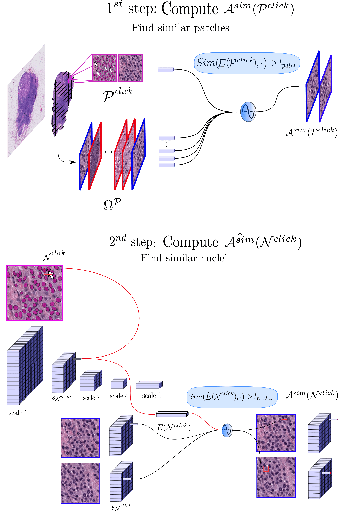

## This repository offers an enhancement to the article:
### *Smart Learning of Click and Refine for Nuclei Segmentation on Histology Images*




### 1. Download PanNuke Dataset: 

You can Download the dataset here:[PanNuke](https://warwick.ac.uk/fac/cross_fac/tia/data/pannukeg).

The dataset contains 3 folders: folder 1,2,3.

In the config file  [config](config.py), precise the folder location:

```
path_panuke = FOLDER_LOCATION
```

### 2. Process data:

run 
```
python np_to_images_folder.py
```
this code:

* **1.** $~~~~~$ Opens the images.npy and mask.npy for each folder
* **2.** $~~~~~$ Corrects wrong annotations
* **3.** $~~~~~$ Saves each patch and each ground truth annotations as .tif files

### 3. Run train/test/val split:
run
```
python train_test_val.py --ptrain 0.75  --pval 0.125
```

This code generates 3 random dataframes. Each dataframe contains filenames of the images belonging to the correponding split. You can choose ```p_train```, ```p_val``` for the proportion of each split.(```p_test = 1 - p_train-p_val```).

### 4. Train Autoencoder:

run 
```
   cd Autoencoder
   python train.py
```


### 5. Generate Contour/Inside from baseline

run 

```
python generate_contour_inside.py --path_annotations

```

```path_annotations``` is the path of the annotations.
It can be the ground truth annotations or the predictions from a baseline nuclei segmentation on your images.

If you have a baseline nuclei segmentation of your images, store it in ```path_baseline\baseline```.

To convert the ground truth annotations to contours and masks choose ```path_annotations=path_gt```
To convert the baseline predictions to contours and mask choose ```path_annotations=path_baseline```

### 6. Modify the baseline segmentation by adding merged and splited nucleis.


run 

```
python fast_augment_save.py
```

If the baseline nuclei segmentation doesn't have much splits/merges. 

This code **create an augmented segmentation by adding split and merges errors on random nucleis in each images and save the new annotations, contours and insides in a new folder**.

It also creates a clickmap for each image by comparing the ground truth to the baseline segmentation.

The click map has 4 channels:

* 1<sup>st</sup> channel is for False Positive nuclei (FP)
* 2<sup>nd</sup> channel is for merged nucleis
* 3<sup>rd</sup> channel is for splitted nucleis
* 4<sup>th</sup> channel is for FN nuclei (FN)


### 7. Train Click_ref

```
cd Click_ref
python train.py
```
This code uses the baseline segmentation and the click maps generated to train the click_ref module to reconstruct the ground truth.


### 8.


<!-- @INPROCEEDINGS{9897496,
  author={Habis, Antoine and Meas-Yedid, Vannary and González Obando, Daniel Felipe and Olivo-Marin, Jean-Christophe and Angelini, Elsa D.},
  booktitle={2022 IEEE International Conference on Image Processing (ICIP)}, 
  title={Smart Learning of Click and Refine for Nuclei Segmentation on Histology Images}, 
  year={2022},
  volume={},
  number={},
  pages={2281-2285},
  doi={10.1109/ICIP46576.2022.9897496}} -->